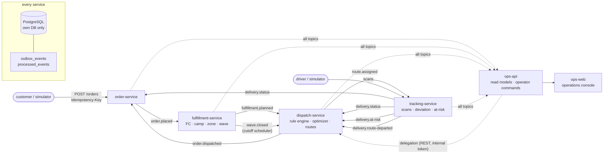

# Dawnline

[한국어](README.md) · **English**

**A same-day / early-morning delivery dispatch platform** — an event-driven microservices portfolio that takes an order from
intake to a driver's route using a rule engine and cost-based route optimization.
Java 25 · Spring Boot 4.1 · Kafka 4.3 (KRaft) · PostgreSQL 18 · Redis 8 · React 19.

> **Status — Phases 0–7 complete (2026-09-28).** Everything not built is in the ledger **with the condition that would reopen it**
> ([IMPLEMENTATION_PLAN.md](docs/IMPLEMENTATION_PLAN.md) §7-0). Every number in this README is a measurement with a source —
> nothing unmeasured is claimed.
>
> The design documents, ADRs and reports are written in Korean. This page is the English entry point; the links go to the
> Korean originals.

The project sets out to demonstrate four things.

1. **Rule-based minimum-cost delivery** — hard and soft rules are data in the database, not code, and a heuristic pipeline runs on
   top of a cost model. Operators can query *why this order went to this vehicle* and *why it is unassigned*.
2. **An event-driven MSA with no loss or duplication by construction** — transactional outbox + idempotent consumers,
   database per service, no synchronous calls between core services.
3. **Peak load and failures** — a one-hour window of 45,000 orders; Kafka, Redis, database and instance failures, all checked
   against the same verification table V1–V10.
4. **How all of that is kept honest by measurement** — see [below](#how-it-is-measured--what-sets-this-repository-apart).
   What sets this repository apart is not the algorithm but that section.

---

## Reproduce in ten minutes

Prerequisites: Docker (Compose v2) and Git. **No JDK install is needed** — the Gradle wrapper downloads Temurin 25
([ADR-014](docs/adr/ADR-014-jdk25-toolchain-auto-provisioning.md)).

```bash
git clone <repo> && cd dawnline
make images     # five service images (Buildpacks) + ops-web — the first run downloads the builder image
make up         # PostgreSQL · Kafka · Redis · Prometheus · Grafana · Tempo · five services · ops-web
make demo       # order → wave close → plan → publish → driver scans → reassignment; prints URLs at the end
```

`make up && make demo` took **3 min 24 s** on the author's machine (macOS, 14 cores, images already built, 2026-09-28).
The same sequence including the image build, on a clean runner, runs on every pull request as CI's "Compose smoke" job and
takes 8–9 minutes. What `make demo` points you to:

| What | Where |
|---|---|
| Operations console (waves · route map · unassigned explanations) | `http://localhost:8090` — token: `make token ROLE=OPS_OPERATOR` |
| API docs | `http://localhost:8081/swagger-ui.html` (order) · same path on every service |
| Four dashboards · 16 alert rules | Grafana `http://localhost:3000` |
| A single trace | Grafana → Traces (see [one trace](#one-trace) below) |

Also: `./gradlew build` (unit · ArchUnit · contract tests · coverage gate) · `./gradlew integrationTest` (Testcontainers) ·
`make chaos-kafka|chaos-redis|chaos-db|chaos-kill` (fault injection + verification table) ·
`make sim-reset sim-up peak PEAK=peak-day` (window scenarios).

---

## Architecture



- **Writes between services go through events only.** Core services never call each other synchronously — the only synchronous
  direction is ops-api → core ([ADR-012](docs/adr/ADR-012-read-models-live-in-ops-api.md)).
- **Transactional outbox + idempotent consumers.** A state change and its event share one database transaction
  ([ADR-002](docs/adr/ADR-002-db-per-service-polling-outbox.md)), and every listener records `processed_events` in the same
  transaction as its work ([ADR-006](docs/adr/ADR-006-at-least-once-idempotent-consumer.md)). Duplicates are absorbed, not removed.
- **Redis is not a source of truth.** Locks are fail-open coordinators; the guarantee comes from database rows
  ([ADR-005](docs/adr/ADR-005-redis-lock-coordinates-the-row-guarantees.md)).
- **Hexagonal architecture enforced by ArchUnit.** `dispatch-service`'s `domain.optimizer` is plain Java, so the benchmark tool
  runs **the same code** as the service.
- Event contracts are committed JSON Schemas; contract tests check examples and published payloads against them
  ([ADR-003](docs/adr/ADR-003-json-schema-event-contracts.md)).

---

## The dispatch optimizer

For one wave (camp · service tier · cutoff) it looks for the set of routes that minimizes total cost. It is a variant of the
capacitated vehicle routing problem with time windows (CVRPTW) and NP-hard, so "optimal" is defined as **a verified improvement
over a frozen baseline within a time budget**.

```
cost = Σ_route [ fixed + km·perKm + min·perMin + Σ_stop late·penalty ] + Σ_unassigned penalty + Σ soft rules
```

Pipeline: `stop merging → sweep clustering → seat reservation by constraint class · greedy assignment → nearest-neighbour
sequencing → local search → hard-rule revalidation`. Strategies are plug-ins (`baseline-nn` frozen · `sweep-greedy-nn+ls`
default · `savings-cw+ls`), and degradation is a ladder: halve the improvement budget, then skip improvement
([ADR-034](docs/adr/ADR-034-degrade-mode.md)).

**Benchmark** — [Phase 4 closing report](docs/benchmarks/phase4-strategies.md), fixed seed, every run converged, total cost (KRW):

| Dataset | `baseline-nn` | `sweep-greedy-nn+ls` (default) | `savings-cw+ls` | vs. fixed-cost floor (default) |
|---|---:|---:|---:|---:|
| small (500 orders / 5 vehicles) | 1,517,523 | **1,113,911 (−26.60%)** | 1,262,833 (−16.78%) | 1.42× |
| medium (2,000 / 20) | 4,588,065 | 3,791,148 (−17.37%) | **3,656,891 (−20.29%)** | 1.47× |
| large (5,000 / 40) | 9,577,578 | 8,147,294 (−14.93%) | **7,834,800 (−18.20%)** | 1.44× |
| peak (15,000 / 88) | 28,369,930 | 21,509,847 (−24.18%) | **20,737,822 (−26.90%)** | 1.35× |

**Known regimes** — the table also says what it does *not* measure.

- **On `small`, `savings-cw+ls` loses** (+13.4%, unassigned 0 → 3). When construction reduces the number of routes, on a small
  dataset the shift of decision-making from reinsertion to construction is itself the loss — so the default strategy stays
  ([ADR-043](docs/adr/ADR-043-default-strategy-stays-until-peak-converges.md)).
- **`overload` is deliberately infeasible.** It measures the unassigned policy, the upper bound on planning time and degradation —
  not routing quality — and is reported in a separate section.
- **The fixed-cost floor is a bound, not a target.** A variant pushed towards it paid 55× more in unassigned penalties; empty seats
  are where scarce-capability demand sits later ([ADR-038](docs/adr/ADR-038-fixed-cost-floor-is-not-a-total-cost-floor.md)).
  The comparison is against this bound, not against another solver
  ([ADR-004](docs/adr/ADR-004-compare-against-the-boundary-not-another-solver.md)).
- **2026-09-28 — the regime behind this table changed.** Its waves mixed three promise windows, but a real wave has one (DESIGN §2.2).
  Fixing the tool increased stop merging and made time the binding axis, so a time axis was added to the feasibility criteria and
  fleet sizes were re-derived (`peak` 115 · `large` 42). The three-window data survives as `mixed-windows`.
  See the [four columns](docs/benchmarks/phase7-one-window-per-wave.md) and
  [ADR-075](docs/adr/ADR-075-promise-start-is-a-floor-vehicle-time-belongs-to-the-earlier-plan.md).
  **It has not been re-measured with the new fleet sizes** — the next change that quotes benchmark numbers will rerun all five
  datasets on the new basis.

---

## Peak load and failures

**Window scenarios** — [7-4 report](docs/benchmarks/phase7-window-scenarios.md). Simulation clock (effective 22:58–23:58,
[ADR-066](docs/adr/ADR-066-simulation-moves-the-clock-not-the-schedule.md)), ten camps, cold stack at start, drivers at 600× speed:

| | `peak-day` | `overload-day` | `normal-day` | `cold-heavy` | `turbulent` | **`turbulent` final** |
|---|---:|---:|---:|---:|---:|---:|
| Orders · window | 45,000 · 12.5 rps | 45,000 | 9,000 | 9,000 (40% chilled) | 45,000 + cancels · delays · failures | same |
| Order API p50 / p99 | 6.7 / 13.6 ms | 6.7 / 13.9 | 11.3 / 19.1 | 11.2 / 18.6 | 6.6 / 13.7 | 6.4 / 13.7 |
| Fleet | +304 added | as is | as is | as is | +297 added | +297 added |
| DAWN unassigned | **0.27%** | 62.18% | 0 | 0 | **0.35%** | **0.38%** |
| Plan mode · longest compute | FULL · 13.9 s | FULL · 16.6 s | FULL · 4.6 s | FULL · 9.4 s | FULL · 14.3 s | FULL · 14.4 s |
| Verification table | V1–V8 ✅ | ✅ | ✅ | ✅ | V1–V8 ✅ · V9 ✗ 12 · V10 ✗ 42 pairs | **V1–V10 ✅** · V9 0 · V10 0 |

`overload-day` is the same volume without adding vehicles — the shortfall the calculation reports matches `peak-day`'s additions
**exactly, vehicle for vehicle** ([ADR-067](docs/adr/ADR-067-peak-fleet-is-an-operator-command.md)). The three defects `turbulent` found —
12 orders cancelled before planning were delivered (V9), one vehicle was in two places at once (V10), and a vehicle deactivated
during planning could have a route published — each went in first as a red reproduction test and was then closed
([ADR-074](docs/adr/ADR-074-cancel-before-candidate-leaves-a-row.md) ·
[ADR-075](docs/adr/ADR-075-promise-start-is-a-floor-vehicle-time-belongs-to-the-earlier-plan.md) · ADR-067 follow-up).
**The final column is the run after those fixes.** It also reports the §8.1 SLOs: order API p99 13.7 ms · intake → dispatch
candidate p95 0.23 s · plan time p95 11.3 s · outbox lag p95 0.107 s · on-time rate 99.37% of completed deliveries (96.49% if
the 3% injected failures count as not on time). Two new findings — a 3.9% capacity shortfall on NEXT_DAY that the double booking
had been hiding, and more `no-anchor` replans — were recorded in the ledger with conditions, and nothing more
([report](docs/benchmarks/phase7-window-scenarios.md) §3.9).

**Failures** — `make chaos-kafka` · `chaos-redis` · `chaos-db` · `chaos-kill`: all four pass the verification table during the
fault and after recovery (0 lost · 0 duplicated · 0 DLQ · 0 quarantined outbox rows). With Redis stopped, publishing lag peaked
at 0.110 s — locks fail open and correctness lives in database rows. Runbooks RB-01–07 and the 16-alert response table are in
[docs/runbooks](docs/runbooks/README.md).

---

## One trace


One request from an operator closing a wave early becomes a single trace across **five services · 636 spans · 1.65 s** —
ops-api's `POST …/close` → fulfillment closes the wave → outbox relay → `wave.closed` → dispatch plans → `route.assigned` →
tracking, and `order.dispatched` → order. (Local stack after `make demo`, Grafana Traces panel, 2026-09-28.)

The trace survives the outbox — the envelope carries `traceparent`, and the relay does not overwrite it with its own polling trace
([ADR-062](docs/adr/ADR-062-trace-survives-the-outbox.md)).

---

## How it is measured — what sets this repository apart

**Measurement makes the decision — before implementation, and at a size that can change the decision.** Before an optimization
is built, a **shadow measurement** bounds it: the check is computed but behaviour is not changed, and the existing code counts how
much work the mechanism could have skipped or saved. The ledger holds **eleven** of these and every one decided something — four
led to *not building* (parallel unit · skip-scanning · cluster slack · a second FAST reinsertion), and one fixed the *tool*
rather than the algorithm (waiting → the benchmark's promise windows). Along the way, three ways of being wrong became **paired
rules**: an upper bound can be wrong **upwards** (the measured term was not recoverable), **downwards** (the change touched more
terms than were measured), and an upper bound passing its condition is **a different claim from total cost improving**. When a
dataset is fixed, two questions separate a tool fix from "passing with data" — *does it fail under any algorithm?* and *does the
dataset break its own stated premise?* — and before/after is kept as columns: the three columns of
[ADR-033](docs/adr/ADR-033-constraint-classes.md), the four of
[ADR-075](docs/adr/ADR-075-promise-start-is-a-floor-vehicle-time-belongs-to-the-earlier-plan.md). Tests follow the same
discipline — **eighteen** times it was recorded what a green test was *not* checking (DESIGN §13, "axes the fixture did not
decide"), and each became a rule: iterate over sets by exclusion, state a fallback test's premise as its first assertion, count
metrics after commit, and cross-check lists that are meant to mirror each other.
Details: [DESIGN §6.9](docs/DESIGN.md) · [shadow-measurement ledger](docs/benchmarks/phase4-strategies.md) §7.

So the numbers here are a **path**, not a "we beat it". The `large` goal of "≥ 15% savings" first measured −11.84%, but the
ruler was bent — 34% of the total cost was an unassigned penalty no algorithm could avoid. With the ruler straightened it was
**−14.53%** (ADR-033's three columns); then the bonus ruler (ADR-040), the clustering axis (ADR-041) and the way routes are built
(ADR-042) were fixed in turn, reaching **−18.20%** — the last change was not aimed at the target and crossed it. Every step is a
column in a table, which is what shows the target was not passed with data.

Which document answers which interview question is in [DESIGN appendix B](docs/DESIGN.md) — "How do you trust your tests?",
"How far from optimal is it?", "What happens at peak?".

---

## Tech stack

Versions are pinned only in `gradle/libs.versions.toml`, `deploy/compose/.env` and `apps/ops-web/package.json`.

| Layer | Choice |
|---|---|
| Language · build | Java 25 LTS (Temurin, auto-provisioned) · Gradle 9 Kotlin DSL · `-Werror` |
| Framework | Spring Boot 4.1 (Spring Framework 7 · Spring Kafka 4.1 · Security 7.1 · Hibernate 7) · Jackson 3 · Flyway |
| Data · messaging | PostgreSQL 18 (database per service) · Kafka 4.3 KRaft · Redis 8 (GEO · Lua · NX) |
| Observability | Micrometer + OpenTelemetry → Prometheus · Grafana · Tempo |
| Testing | JUnit · AssertJ · Testcontainers · ArchUnit · WireMock · k6 |
| Frontend | React 19 · Vite · TypeScript · Leaflet — client types generated from the committed OpenAPI ([ADR-056](docs/adr/ADR-056-ops-web-client-is-typed-from-the-committed-contract.md)) |
| Images · release | Buildpacks (`bootBuildImage`, [ADR-013](docs/adr/ADR-013-container-image-buildpacks.md)) · nginx Dockerfile for ops-web · a tag release pushes to GHCR with SBOMs (`release.yml`) |

## Repository layout

```
docs/{DESIGN.md, IMPLEMENTATION_PLAN.md, adr/, benchmarks/, runbooks/}
contracts/{events, openapi}          # JSON Schemas + examples · committed OpenAPI
libs/{common, messaging, observability, web}
services/{order, fulfillment, dispatch, tracking}-service · services/ops-api
apps/ops-web                         # operations console
tools/{sim-runner, benchmark, chaos, sim, demo}
deploy/compose                       # full local stack (no k8s — ADR-011)
```

## Out of scope — with the condition that reopens it

| What | Condition | Where |
|---|---|---|
| Comparison with an external solver (Timefold) | three conditions | [ADR-004](docs/adr/ADR-004-compare-against-the-boundary-not-another-solver.md) |
| Parallelism inside a plan · virtual threads | truncation cost ≥ 1% · observed thread starvation | [ADR-008](docs/adr/ADR-008-no-virtual-threads-no-intra-plan-parallelism.md) |
| OSRM road distances | when absolute times become promises | [ADR-010](docs/adr/ADR-010-haversine-with-road-factor-no-osrm.md) |
| k8s · static membership | a deployment with more than one instance | [ADR-011](docs/adr/ADR-011-static-membership-documented-not-deployed.md) |
| Time-aware sequencing | when multi-window waves enter the model | ledger A39 |
| A time axis for the operational fleet calculation | `late-hard-limit` unassigned > 0.5% after adding vehicles | ledger A40 |

The full list is the closing table at the end of [IMPLEMENTATION_PLAN.md](docs/IMPLEMENTATION_PLAN.md).

## Documents

| Document | Contents |
|---|---|
| [docs/DESIGN.md](docs/DESIGN.md) | The design — the source of truth. When design and code disagree, the design is changed first |
| [docs/adr/](docs/adr/README.md) | 75 decisions — what was chosen and why, what was rejected and why; defect claims carry an evidence label (observed · inferred · reproduction failed) |
| [docs/benchmarks/](docs/benchmarks/) | Measurement reports — commit · seed · strategy are their identity |
| [docs/runbooks/](docs/runbooks/README.md) | 16 alerts × responses; the first line of each is a metric, a log or a SQL query |
| [docs/IMPLEMENTATION_PLAN.md](docs/IMPLEMENTATION_PLAN.md) | Work and DoD per phase · the carry-over ledger |
| [CLAUDE.md](CLAUDE.md) | 13 architectural invariants and working rules |
