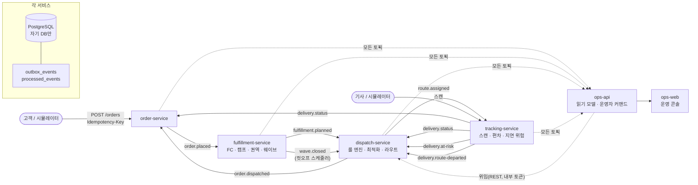
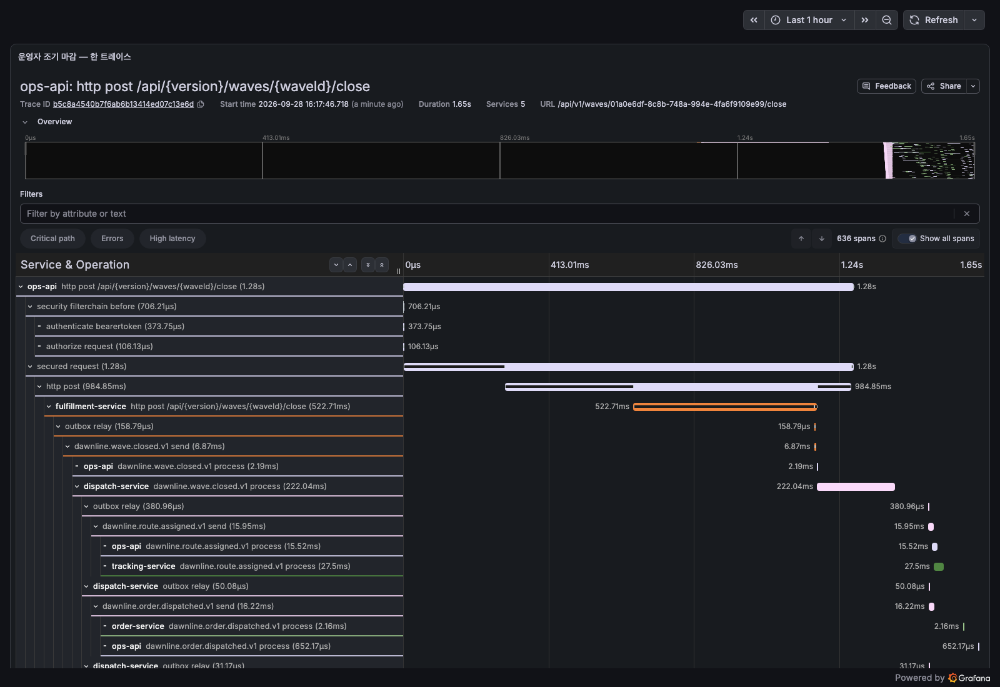

# Dawnline

**한국어** · [English](README.en.md)

**당일·새벽 배송 디스패치 플랫폼** — 주문 접수부터 기사 경로 배정까지를 룰 엔진과 비용 기반 경로 최적화로 푸는
이벤트 드리븐 MSA 포트폴리오. Java 25 · Spring Boot 4.1 · Kafka 4.3(KRaft) · PostgreSQL 18 · Redis 8 · React 19.

> **상태 — Phase 0–7 완료 (2026-09-28).** 구현하지 않은 것은 전부 **다시 여는 조건과 함께** 원장에 있다
> ([IMPLEMENTATION_PLAN.md](docs/IMPLEMENTATION_PLAN.md) 7-0). 이 README 의 수치는 모두 측정이고 출처를 단다 —
> 측정하지 않은 것은 주장하지 않는다.

이 프로젝트가 증명하려는 것은 넷이다.

1. **룰 기반 최소 비용 배송** — 하드/소프트 룰은 코드가 아니라 DB 의 데이터이고, 비용 모델 위에서 휴리스틱 파이프라인이 돈다.
   「왜 이 주문이 이 차에 · 왜 미배정」을 운영자가 조회한다.
2. **유실 · 중복이 구조적으로 없는 이벤트 드리븐 MSA** — Outbox + 멱등 소비자, 서비스별 DB, 코어 간 동기 호출 없음.
3. **성수기와 장애** — 45,000 주문 한 시간 창, Kafka · Redis · DB · 인스턴스 장애에서 검증 표 V1–V10.
4. **그것을 측정으로 지키는 방법** — [아래](#측정하는-방법--이-저장소가-다른-점). 이 저장소의 차별점은 알고리즘이 아니라 이 절이다.

---

## 10분 안에 재현하기

전제: Docker(Compose v2) · Git. **JDK 설치는 필요 없다** — Gradle wrapper 가 Temurin 25 를 내려받는다([ADR-014](docs/adr/ADR-014-jdk25-toolchain-auto-provisioning.md)).

```bash
git clone <repo> && cd dawnline
make images     # 서비스 이미지 5개(Buildpacks) + ops-web — 첫 실행은 빌더 이미지를 내려받는다
make up         # PostgreSQL · Kafka · Redis · Prometheus · Grafana · Tempo · 서비스 5개 · ops-web
make demo       # 주문 → 웨이브 마감 → 계획 → 발행 → 기사 스캔 → 재배정, 끝에 확인할 URL 을 출력
```

`make up && make demo` 는 이 기계(macOS · 14 코어, 이미지가 있는 상태)에서 **3분 24초** 걸렸다(2026-09-28). 깨끗한 러너에서 이미지 빌드까지
포함한 같은 순서는 CI 의 「Compose 스모크」 job 이 매 PR 마다 돌고 8–9분이다.
`make demo` 가 끝에 출력하는 곳:

| 무엇 | 어디 |
|---|---|
| 운영 콘솔(웨이브 · 라우트 지도 · 미배정 설명) | `http://localhost:8090` — 토큰은 `make token ROLE=OPS_OPERATOR` |
| API 문서 | `http://localhost:8081/swagger-ui.html` (order) · 서비스마다 같은 경로 |
| 대시보드 넷 · 알림 규칙 16 | Grafana `http://localhost:3000` |
| 한 주문의 트레이스 | Grafana → Explore → Tempo (아래 [트레이스 한 줄](#트레이스-한-줄)) |

그 밖: `./gradlew build`(단위 · ArchUnit · 계약 · 커버리지 게이트) · `./gradlew integrationTest`(Testcontainers) ·
`make chaos-kafka|chaos-redis|chaos-db|chaos-kill`(장애 주입 + 검증 표) · `make sim-reset sim-up peak PEAK=peak-day`(창 시나리오).

---

## 아키텍처



- **서비스 간 쓰기 경로는 이벤트만.** 코어끼리 동기 REST 가 없다 — 동기 호출은 ops-api → 코어 한 방향([ADR-012](docs/adr/ADR-012-read-models-live-in-ops-api.md)).
- **Transactional Outbox + 멱등 소비자.** 상태 변경과 이벤트가 한 DB 트랜잭션이고([ADR-002](docs/adr/ADR-002-db-per-service-polling-outbox.md)),
  모든 리스너가 `processed_events` 를 같은 트랜잭션에서 기록한다([ADR-006](docs/adr/ADR-006-at-least-once-idempotent-consumer.md)). 중복은 제거가 아니라 흡수다.
- **Redis 는 진실 저장소가 아니다.** 락은 fail-open 조정자이고 보장은 DB 행이 한다([ADR-005](docs/adr/ADR-005-redis-lock-coordinates-the-row-guarantees.md)).
- **헥사고날 + ArchUnit.** `dispatch-service` 의 `domain.optimizer` 는 순수 Java 라 벤치마크 도구가 서비스와 **같은 코드**를 돌린다.
- 이벤트 계약은 커밋된 JSON Schema, 계약 테스트가 예시와 발행물을 대조한다([ADR-003](docs/adr/ADR-003-json-schema-event-contracts.md)).

---

## 디스패치 최적화 엔진

웨이브 하나(캠프 · 티어 · 컷오프)에 대해 총비용을 최소화하는 라우트 집합을 찾는다 — 시간창 · 용량 제약 차량 경로 문제(CVRPTW)의
변형이고 NP-hard 라서 「최적」을 **주어진 예산 안에서 베이스라인 대비 검증된 개선**으로 정의한다.

```
cost = Σ_route [ fixed + km·perKm + min·perMin + Σ_stop late·penalty ] + Σ_미배정 penalty + Σ 소프트 룰
```

파이프라인: `Stop 통합 → Sweep 클러스터링 → 제약 조합 좌석 예약 · Greedy 배정 → 최근접 순서 → Local Search → 하드 룰 재검증`.
전략은 플러그인이고(`baseline-nn` 동결 · `sweep-greedy-nn+ls` 기본 · `savings-cw+ls`), 열화는 사다리다(개선 예산 절반 → 개선 생략, [ADR-034](docs/adr/ADR-034-degrade-mode.md)).

**벤치마크** — [Phase 4 마감 리포트](docs/benchmarks/phase4-strategies.md), seed 고정 · 전 실행 수렴 종료 · 총비용(원):

| 데이터셋 | `baseline-nn` | `sweep-greedy-nn+ls` (기본) | `savings-cw+ls` | 고정비 하한 대비(기본) |
|---|---:|---:|---:|---:|
| small (500 주문 / 5대) | 1,517,523 | **1,113,911 (−26.60%)** | 1,262,833 (−16.78%) | 1.42배 |
| medium (2,000 / 20) | 4,588,065 | 3,791,148 (−17.37%) | **3,656,891 (−20.29%)** | 1.47배 |
| large (5,000 / 40) | 9,577,578 | 8,147,294 (−14.93%) | **7,834,800 (−18.20%)** | 1.44배 |
| peak (15,000 / 88) | 28,369,930 | 21,509,847 (−24.18%) | **20,737,822 (−26.90%)** | 1.35배 |

**알려진 레짐** — 표가 무엇을 재지 *않는지*도 같이 적는다.

- **`small` 에서는 `savings-cw+ls` 가 진다**(+13.4%, 미배정 0 → 3). 구성이 라우트를 줄이면 작은 데이터셋에서는 계획을 정하는 몫이
  재삽입에서 구성으로 옮겨간 것 자체가 손해다 — 그래서 기본 전략은 그대로다([ADR-043](docs/adr/ADR-043-default-strategy-stays-until-peak-converges.md)).
- **`overload` 는 일부러 못 싣는 데이터셋**이다 — 재는 것은 라우팅 품질이 아니라 미배정 정책 · 계획 시간의 상한 · 열화다. 같은 절에 싣지 않는다.
- **고정비 하한은 불가능의 경계이지 목표가 아니다** — 하한 쪽으로 민 변형은 미배정 페널티가 55배 뛰었다. 빈 좌석은 희소 능력 수요가 앉을 자리다
  ([ADR-038](docs/adr/ADR-038-fixed-cost-floor-is-not-a-total-cost-floor.md)). 비교 대상은 다른 솔버가 아니라 이 경계다([ADR-004](docs/adr/ADR-004-compare-against-the-boundary-not-another-solver.md)).
- **2026-09-28 — 이 표의 레짐이 바뀌었다.** 위 표의 웨이브에는 약속창이 셋 섞여 있었는데 실제 웨이브에는 하나다(§2.2). 도구를 고치자 통합이
  늘고 시간이 무는 축이 됐다 — 실현 가능성 기준에 시간 축을 더하고 대수를 다시 냈다(`peak` 115 · `large` 42). 창 셋은 `mixed-windows`
  로 남았다. [네 열](docs/benchmarks/phase7-one-window-per-wave.md) · [ADR-075](docs/adr/ADR-075-promise-start-is-a-floor-vehicle-time-belongs-to-the-earlier-plan.md).
  **새 대수로는 다시 재지 않았다** — 벤치마크 수치를 인용하는 다음 변경이 다섯 데이터셋을 새 기준으로 낸다.

---

## 성수기와 장애

**창 시나리오** — [7-4 리포트](docs/benchmarks/phase7-window-scenarios.md). 시뮬레이션 시계(유효 22:58–23:58, [ADR-066](docs/adr/ADR-066-simulation-moves-the-clock-not-the-schedule.md)),
10 캠프, 콜드 스택에서 시작, 기사는 배속 600:

| | `peak-day` | `overload-day` | `normal-day` | `cold-heavy` | `turbulent` | **`turbulent` 최종** |
|---|---:|---:|---:|---:|---:|---:|
| 주문 · 창 | 45,000 · 12.5 rps | 45,000 | 9,000 | 9,000 (냉장 40%) | 45,000 + 취소 · 지연 · 실패 | 같다 |
| 주문 API p50 / p99 | 6.7 / 13.6 ms | 6.7 / 13.9 | 11.3 / 19.1 | 11.2 / 18.6 | 6.6 / 13.7 | 6.4 / 13.7 |
| 함대 | 증차 +304 | 그대로 | 그대로 | 그대로 | 증차 +297 | 증차 +297 |
| DAWN 미배정 | **0.27%** | 62.18% | 0 | 0 | **0.35%** | **0.38%** |
| 계획 모드 · 최장 계산 | FULL · 13.9초 | FULL · 16.6초 | FULL · 4.6초 | FULL · 9.4초 | FULL · 14.3초 | FULL · 14.4초 |
| 검증 표 | V1–V8 ✅ | ✅ | ✅ | ✅ | V1–V8 ✅ · V9 ✗ 12 · V10 ✗ 42쌍 | **V1–V10 ✅** · V9 0 · V10 0 |

`overload-day` 는 증차 없이 같은 물량이다 — 계산이 낸 부족분이 `peak-day` 의 증차와 **한 대도 다르지 않다**([ADR-067](docs/adr/ADR-067-peak-fleet-is-an-operator-command.md)).
`turbulent` 가 찾은 결함 셋 — 계획 전 취소 12건이 배송됐다(V9) · 한 차량이 한 시각에 두 곳에 있었다(V10) · 계획 중 비활성화된 차의 라우트가 발행될 수 있었다 —
은 각각 재현 IT(빨강)로 들어가 닫혔고([ADR-074](docs/adr/ADR-074-cancel-before-candidate-leaves-a-row.md) · [ADR-075](docs/adr/ADR-075-promise-start-is-a-floor-vehicle-time-belongs-to-the-earlier-plan.md) · ADR-067 후속), **최종 열이 그 뒤의 실행이다.**
최종 실행은 §8.1 SLO 도 표로 낸다 — 주문 p99 13.7 ms · E2E(접수 → 후보) p95 0.23초 · 계획 p95 11.3초 · outbox p95 0.107초 ·
정시율 99.37%(완료 기준, 실패 주입 3% 를 분모에 넣으면 96.49%) — 그리고 새로 드러난 둘(NEXT_DAY 의 용량 부족 3.9% — 이중 배정이
가리고 있었다 · 재계획 `no-anchor` 증가)은 원장에 조건과 함께 기록만 했다([리포트](docs/benchmarks/phase7-window-scenarios.md) §3.9).

**장애** — `make chaos-kafka` · `chaos-redis` · `chaos-db` · `chaos-kill`: 넷 다 장애 중 · 복구 뒤 검증 표 ✅(유실 0 · 중복 0 · DLQ 0 · outbox 격리 0).
Redis 를 멈춰도 발행 지연 최대 0.110초 — 락은 fail-open 이고 정확성은 DB 행이다. 런북 RB-01–07 과 알림 16 × 대응 표는 [docs/runbooks](docs/runbooks/README.md).

---

## 트레이스 한 줄



운영자가 웨이브를 조기 마감한 요청 하나가 **다섯 서비스 · 636 span · 1.65초**로 한 트레이스에 이어진다 — ops-api 의 `POST …/close` →
fulfillment 의 마감 → outbox 릴레이 → `wave.closed` → dispatch 의 계획 → `route.assigned` → tracking, 그리고 `order.dispatched` → order.
(`make demo` 뒤의 로컬 스택, Grafana 의 Traces 패널 — 2026-09-28)

outbox 를 지나도 트레이스가 끊기지 않는다 — 봉투에 `traceparent` 를 싣고 릴레이가 자기 폴링의 트레이스로 덮지 않는다([ADR-062](docs/adr/ADR-062-trace-survives-the-outbox.md)).

---

## 측정하는 방법 — 이 저장소가 다른 점

**측정이 결정을 정한다 — 구현 전에, 그리고 결정을 바꿀 수 있는 크기로.** 최적화 항목은 만들기 전에 **그림자 계측**으로 상한을 잰다: 판정은
계산하되 동작은 바꾸지 않고, 그 기계장치가 건너뛰거나 줄일 수 있었을 일의 양을 기존 코드 안에서 센다. 원장에 **열한 번** 있고 열한 번 모두
결정을 정했다 — 넷은 **만들지 않기로** 했고(병렬 단위 · 안 훑기 · 클러스터 여유 · FAST 재삽입 한 번 더), 하나는 알고리즘이 아니라 **도구를
고치게** 했다(기다림 → 벤치마크 웨이브의 창). 그 과정에서 틀린 방식 셋을 **짝 문장**으로 규칙에 넣었다 — 상한이 **위로** 틀린다(잰 항이 회수
대상이 아니었다), **아래로** 틀린다(변경이 잰 항보다 많은 항을 건드렸다), 그리고 상한이 조건을 넘긴 것과 **총비용이 좋아지는 것은 다른 명제**다.
데이터셋을 고칠 때는 두 질문(어떤 알고리즘으로도 실패하는가 · 데이터셋이 자기 전제를 어기는가)으로 「데이터로 통과시키기」와 가르고, 전후를 열로
남긴다 — [ADR-033](docs/adr/ADR-033-constraint-classes.md) 의 세 열과 [ADR-075](docs/adr/ADR-075-promise-start-is-a-floor-vehicle-time-belongs-to-the-earlier-plan.md) 의 네 열.
테스트도 같은 방식이다 — 초록이 무엇을 검사하지 않았는지를 **열여덟 번** 기록했고(DESIGN §13 「픽스처가 정하지 않은 축」), 그때마다 규칙이 됐다:
집합은 빼는 방식으로 돈다 · 폴백 테스트는 전제를 첫 어설션으로 말한다 · 카운터는 커밋 뒤에 센다 · 서로를 비추는 목록에는 대조 검사를 둔다.
상세: [DESIGN §6.9](docs/DESIGN.md) · [그림자 계측 원장](docs/benchmarks/phase4-strategies.md) §7.

그래서 이 저장소가 말하는 수치는 「넘겼다」가 아니라 **경로**다. `large` 의 「≥ 15% 절감」은 처음에 −11.84% 로 재졌는데 자가 휘어 있었다 —
총비용의 34%가 어떤 알고리즘으로도 실을 수 없는 미배정 페널티였다. 자를 곧게 펴자 **−14.53%** 였고(ADR-033 의 세 열), 그 뒤 보너스의
자(ADR-040) · 클러스터의 축(ADR-041) · 라우트를 만드는 방법(ADR-042)을 차례로 고쳐 **−18.20%** 가 됐다 — 목표를 겨냥하지 않은 마지막
변경이 목표를 넘겼다. 단계마다 열이 남아 있어 「데이터로 통과시키지 않았다」를 표가 증명한다.

면접 질문별로 답이 되는 문서는 [DESIGN 부록 B](docs/DESIGN.md) 에 있다 — 「테스트를 어떻게 믿나요」 · 「최적에서 얼마나 먼가요」 · 「성수기엔요」.

---

## 기술 스택

버전은 `gradle/libs.versions.toml` · `deploy/compose/.env` · `apps/ops-web/package.json` 에서만 고정한다.

| 계층 | 선택 |
|---|---|
| 언어 · 빌드 | Java 25 LTS(Temurin, 자동 프로비저닝) · Gradle 9 Kotlin DSL · `-Werror` |
| 프레임워크 | Spring Boot 4.1(Spring Framework 7 · Spring Kafka 4.1 · Security 7.1 · Hibernate 7) · Jackson 3 · Flyway |
| 데이터 · 메시징 | PostgreSQL 18(서비스별 DB) · Kafka 4.3 KRaft · Redis 8(GEO · Lua · NX) |
| 관측성 | Micrometer + OpenTelemetry → Prometheus · Grafana · Tempo |
| 테스트 | JUnit · AssertJ · Testcontainers · ArchUnit · WireMock · k6 |
| 프론트 | React 19 · Vite · TypeScript · Leaflet — 클라이언트 타입은 커밋된 OpenAPI 에서 생성([ADR-056](docs/adr/ADR-056-ops-web-client-is-typed-from-the-committed-contract.md)) |
| 이미지 · 릴리스 | Buildpacks(`bootBuildImage`, [ADR-013](docs/adr/ADR-013-container-image-buildpacks.md)) · ops-web 은 nginx Dockerfile · 태그 릴리스가 GHCR 푸시 + SBOM(`release.yml`) |

## 저장소 구조

```
docs/{DESIGN.md, IMPLEMENTATION_PLAN.md, adr/, benchmarks/, runbooks/}
contracts/{events, openapi}          # JSON Schema + 예시 · 커밋된 OpenAPI
libs/{common, messaging, observability, web}
services/{order, fulfillment, dispatch, tracking}-service · services/ops-api
apps/ops-web                         # 운영 콘솔
tools/{sim-runner, benchmark, chaos, sim, demo}
deploy/compose                       # 로컬 전체 스택 (k8s 는 만들지 않았다 — ADR-011)
```

## 범위 밖 — 다시 여는 조건과 함께

| 무엇 | 조건 | 어디 |
|---|---|---|
| 외부 솔버(Timefold) 비교 | 조건 셋 | [ADR-004](docs/adr/ADR-004-compare-against-the-boundary-not-another-solver.md) |
| 계획 안의 병렬 · 가상 스레드 | 잘림의 대가 ≥ 1% · 스레드 고갈 관측 | [ADR-008](docs/adr/ADR-008-no-virtual-threads-no-intra-plan-parallelism.md) |
| OSRM 실도로 거리 | 절대 시각이 약속이 될 때 | [ADR-010](docs/adr/ADR-010-haversine-with-road-factor-no-osrm.md) |
| k8s · static membership | 인스턴스가 둘 이상 뜨는 배포 | [ADR-011](docs/adr/ADR-011-static-membership-documented-not-deployed.md) |
| 시각을 보는 줄 세우기 | 다중 창 웨이브가 모델에 생길 때 | 원장 A39 |
| 운영 증차 계산의 시간 축 | 증차 뒤 `late-hard-limit` 미배정 > 0.5% | 원장 A40 |

전체 목록은 [Phase 7 마감 대조표](docs/IMPLEMENTATION_PLAN.md)에 있다.

## 문서

| 문서 | 내용 |
|---|---|
| [docs/DESIGN.md](docs/DESIGN.md) | 설계서 — 진실의 원천. 설계와 코드가 충돌하면 설계서를 먼저 고친다 |
| [docs/adr/](docs/adr/README.md) | 결정 75개 — 무엇을 왜 택했고 무엇을 왜 버렸는가, 결함 주장은 근거 표기(관측 · 추정 · 재현 실패)와 함께 |
| [docs/benchmarks/](docs/benchmarks/) | 측정 리포트 — 커밋 · seed · 전략이 신원이다 |
| [docs/runbooks/](docs/runbooks/README.md) | 알림 16 × 대응, 첫 줄은 메트릭 · 로그 · SQL |
| [docs/IMPLEMENTATION_PLAN.md](docs/IMPLEMENTATION_PLAN.md) | Phase 별 작업 · DoD · 이월 원장 |
| [CLAUDE.md](CLAUDE.md) | 불변 규칙 13개와 작업 규칙 |
